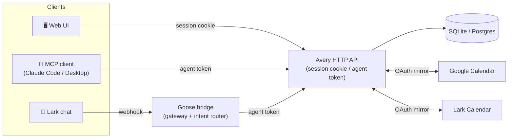

<p align="center">
  
</p>

<h1 align="center">Avery</h1>

<p align="center">
  <em>A personal schedule agent — routine, reality, and the ratio between them.</em>
</p>

<p align="center">
  <a href="https://avery.dodofamily.com"><strong>🌐 Live app</strong></a> ·
  <a href="#install--the-mcp-server">🤖 MCP server</a> ·
  <a href="#the-lark-bot">💬 Lark bot</a> ·
  <a href="#connecting-google--lark-calendars">📅 Calendar sync</a>
</p>

---

Avery holds the three things you can't hold in your head at once:

- **what a normal week looks like** — a *routine*, your recurring blocks
- **what actually happened** — real calendar events, which always drift from the routine
- **what should be true over a month** — a *rule*, a ratio you commit to in advance

Avery is not a calendar. It's a feedback loop: the routine stamps out a week, the week records
reality, and the ratio tells you whether reality matched what you said mattered. Then you adjust
either your behaviour or the rule.

<p align="center">
  
</p>

It's a FastAPI backend, a React calendar, and an MCP server so an assistant like Claude can read
and change your schedule in conversation. Run it locally on SQLite, or deploy it — the hosted
instance runs on Cloud Run + Cloud SQL (see [`DEPLOY.md`](DEPLOY.md)).

---

## Contents

- [Concepts](#concepts)
- [Features](#features)
- [Integrations](#integrations)
  - [The MCP server](#install--the-mcp-server)
  - [The Lark bot](#the-lark-bot)
  - [Google / Lark calendars](#connecting-google--lark-calendars)
- [Onboarding — as a user](#onboarding--as-a-user)
- [Onboarding — as a developer](#onboarding--as-a-developer)
- [API surface](#api-surface)
- [Known gaps](#known-gaps)

---

## Concepts

Four nouns. Getting these straight makes everything else obvious.

| | |
|---|---|
| **Routine** | A named, versioned weekly template. Contains **routine blocks** — "Work, Mon–Fri 09:30–16:30". One routine is active; materialising a week stamps its blocks out as real events. |
| **Event** | One slot on the calendar. Owns its own `title`. Has a `kind`: an **event** is time you spent, a **task** is a to-do with a slot and a checkbox. |
| **Task** | A to-do. Has a due date, a status, and optionally a scheduled event. A task with no event is just a to-do you haven't planned yet. |
| **Rule** | A versioned ratio target — e.g. 6 : 3 : 1 across *Work & Study* / *Family care* / *Fitness*, with a tolerance. Editing a rule closes the old version and opens a new one, so old reports still mean what they meant. |

Events carry **categories** (tags) with colours, which is what the ratio maths groups on.

---

## Features

### Calendar

- **Week view** — full 24 hours, opens scrolled to 07:00. Trackpad **pinch to zoom** (0.5×–3×),
  anchored at the pointer, with both scrollbars appearing as the grid grows.
- **Overlapping events sit side by side** rather than hiding each other. Each card expands into
  whatever columns are genuinely free at its own time, so one long background block doesn't shred
  the whole day into slivers.
- **Routine bands** render behind everything, inert to clicks — so the time they cover is still
  free for quick-create.
- **Month view** with per-day event counts and a stacked tag-proportion bar; click a day for its
  schedule in a side panel.
- **Mini month** in the sidebar for jumping weeks; it follows the grid but never fights your paging.

### Working with events

- **Quick-create** — click any empty grid space (including the 12px strip beside an existing card,
  so you can book over a busy hour). Pick Event or Task, set the time, choose a category.
- **Gestures** on a card: move it to drag; single click opens its detail page; double-click marks it
  done with a confetti burst; drag its top or bottom edge to resize. Drag and resize snap to 15
  minutes.
- **Detail page** — edit title, time (to the *minute*), category and notes. Routine-born events are
  read-only here, with a link through to the block that owns them.
- **Roll over** — at 22:00 Avery offers to move today's unfinished task cards to tomorrow, keeping
  their wall-clock time. Events never move; only to-dos.

### Categories

Create, edit and delete categories from the sidebar — name, colour, description. Deleting one that's
still in use is refused with a count ("12 event(s) still use this category") and archiving offered
instead, so historical hour totals are never silently rewritten. Toggle any category's visibility;
**Hide routine** strips every routine-generated block out of the view in one click. Your selection
survives a reload.

Hiding only changes what's *drawn* — ratios, month aggregates and reports always count everything.

### Routine

Multiple named versions, one active. Fork the active version to start a new one, preview what a week
*would* materialise without writing anything, then activate. Materialising skips any day that already
has events, so it never stomps on work you've already done.

### Rules and analytics

Versioned ratio targets with a tolerance band. The evaluator sums minutes per tag, drops excluded
tags, rolls them into groups, and returns a verdict per group — *on target*, *over*, *under*. It
handles cross-midnight events, zero-ratio groups, untagged time and overlapping events (reported as
warnings rather than silently deduplicated).

The week sidebar shows live progress against the active rule.

### Tasks

Grouped by due date — ascending, with a trailing "no due date" bucket — paginated, with completed
tasks struck through in their own section. A task's due date falls back to the end of its latest
scheduled event when not set explicitly.

### Accounts

Email + password (scrypt) or Google / Lark OAuth sign-in. Sessions are opaque tokens in an httponly
cookie with a 30-day sliding window. **Every API route requires authentication.**

### Reminders

Set reminders against tasks; a background job sweeps every 15 minutes and marks them due. A second
job rolls next week's routine every Sunday.

---

## Integrations

Three ways in besides the web UI. All of them end at the same authenticated HTTP API — there is no
side door.



### Install — the MCP server

Lets an MCP client (Claude Code, Claude Desktop, …) read and change your schedule in conversation.
It talks to the HTTP API over stdio, authenticating with an **agent token**.

**1. Issue an agent token.** There is **no UI for this yet**. While signed in to the web app, open
the browser console and run:

```js
await fetch('/api/agent-tokens', {
  method: 'POST',
  headers: { 'Content-Type': 'application/json' },
  body: JSON.stringify({ name: 'claude', workspace: 'personal' }),
}).then(r => r.json())
```

Copy the `token` field. **It is shown exactly once** — only its hash is stored. Revoke it later with
`DELETE /api/agent-tokens/{id}`.

**2. Point your client at the server.** Copy `.mcp.json.example` to `.mcp.json`, replace the two
absolute paths and paste your token:

```json
{
  "mcpServers": {
    "avery": {
      "command": "/absolute/path/to/avery/backend/.venv/bin/python",
      "args": ["-m", "mcp_server"],
      "cwd": "/absolute/path/to/avery/backend",
      "env": {
        "AVERY_BASE_URL": "http://127.0.0.1:8001",
        "AVERY_AGENT_TOKEN": "paste-the-token-here"
      }
    }
  }
}
```

Set `AVERY_BASE_URL` to `http://127.0.0.1:8001` for a local backend, or to your deployed URL
(e.g. `https://avery.dodofamily.com`) to let the assistant manage the hosted schedule.
`.mcp.json` is git-ignored — it holds a live credential.

**3. Tools it exposes.** Eleven. Ten cover one entity each and take an `action`;
`avery_today` is the cross-entity "what's my day" aggregation.

| Tool | Actions |
|---|---|
| `avery_today(date?)` | — one call for the day's schedule, open to-dos and anything overdue |
| `avery_events` | list, get, create, update, delete, move, complete, uncomplete, roll_over |
| `avery_tasks` | list, get, create, update, archive, stats |
| `avery_tags` | list, get, create, update, delete, archive |
| `avery_routines` | list, get, active, create, update, delete, preview, materialize |
| `avery_routine_blocks` | create, update, delete |
| `avery_rules` | list, get, active, create, update, delete |
| `avery_reminders` | list, get, create, update, delete |
| `avery_reports` | list, run, get, delete |
| `avery_calendar` | week, month |
| `avery_analytics` | evaluate |

All datetimes are naive local (`2026-08-12T15:00:00`); timezone suffixes are
rejected rather than guessed at. The server fails loudly at startup if
`AVERY_AGENT_TOKEN` is missing, rather than on the first tool call.

**Not exposed, deliberately:** `auth`, `agent-tokens`, `jobs`, `seed`. An agent
that could reach `agent-tokens` could mint itself fresh credentials; one that
could reach `auth` could change the account password. Tokens are issued and
revoked from the web app only.

### The Lark bot

Chat with your schedule from Lark — "明天下午三点安排一小时写周报" becomes a booked event. The
chain: your message hits a **Lark bot**, whose webhook lands on the **Goose bridge** (a separate
gateway + LLM intent router, in its own repo); Goose recognises schedule intent, picks a tool from
its schedule skill (`event.create`, `day.view`, `week.view`, `event.move`, `event.complete`,
`rollover`, …) and calls the Avery API with an agent token — the same API surface the MCP server
uses.

To wire it up you need the Goose repo running, then:

1. **Issue an Avery agent token** (console call above) and put it in Goose's env.
2. **Create a Lark app** with a bot capability; put its `App ID` / `App Secret` / `Encrypt Key`
   in Goose's env.
3. **Point the Lark app's event subscription** at the Goose gateway:
   `https://<your-gateway>/lark/events` — Lark sends a challenge on save, so the gateway must be
   running and reachable when you paste the URL.
4. Subscribe the app to `im.message.receive_v1`, publish an app version, and chat.

### Connecting Google / Lark calendars

See [`docs/OAUTH_SETUP.md`](docs/OAUTH_SETUP.md) for provider setup. Sign-in and calendar access are
**separate consents** — signing in with Google does not grant Avery your calendar.

Once connected, Avery **mirrors** provider events into its own table (`source: google` / `lark`),
which means **they count toward your ratios**. The mirror re-syncs every time you view a week, so
provider-side edits flow in on their own. Edits to a mirrored Google event push back to Google;
Lark write-back is not implemented.

> `docs/OAUTH_SETUP.md` is stale on this point — it describes an earlier design where external events
> were an overlay that never entered the database and never counted. The code mirrors and counts them.
> Trust the code.

Google apps in *Testing* mode only authorise whitelisted test users, and their refresh tokens expire
after about seven days, so the connection needs periodic reconnecting.

---

## Onboarding — as a user

You need nothing installed — a deployed instance does it all in the browser
(e.g. **[avery.dodofamily.com](https://avery.dodofamily.com)**).

1. **Create an account** — email + password, or Continue with Google / Lark. Every API route is
   authenticated, so nothing works until you do.
2. **Seed the starter data** — eight categories, a 6:3:1 rule, and a default weekly routine. From
   the browser console while signed in:

   ```js
   await fetch('/api/seed', { method: 'POST' }).then(r => r.json())
   ```

   Seeding is per-user and idempotent — running it twice creates nothing the second time.
3. **Open the week view.** It materialises the current week from your routine on first read. Click
   empty space to create, double-click a card to complete, drag to move.
4. *(Optional)* **Connect your calendars** — Account page → connect Google / Lark; provider events
   mirror in and count toward your ratios.
5. *(Optional)* **Talk to it** — hook up [an MCP client](#install--the-mcp-server) or
   [the Lark bot](#the-lark-bot) and manage your schedule in conversation.

## Onboarding — as a developer

For running the app locally — the stack is FastAPI + async SQLAlchemy + SQLite + Alembic on the
back, React 19 + TypeScript + Vite + Tailwind 4 on the front.

```
backend/          FastAPI + async SQLAlchemy + SQLite + Alembic
  app/            models, routers, services, scheduler
  mcp_server/     stdio MCP server exposing 4 intent-shaped tools
  seeds/          one-shot importer for a real routine/tags/rules snapshot
  tests/          pytest (308 passing)
frontend/         React 19 + TypeScript + Vite + Tailwind 4
  src/            pages, components, hooks, pure-logic lib (133 vitest passing)
docs/             design specs, plans, backlog, OAuth setup
data/             your SQLite database lives here (git-ignored)
Dockerfile        single-container build: static frontend served by the backend
DEPLOY.md         Cloud Run + Cloud SQL + Cloud Scheduler walkthrough
```

### Requirements

- **Python 3.11+** (check with `python3 --version` — 3.10 will not work)
- **Node 20+**

### Backend

```bash
cd backend
python3 -m venv .venv
.venv/bin/pip install -e ".[dev]"
cp .env.example .env
.venv/bin/alembic upgrade head
```

Run it — **on port 8001, not 8000**:

```bash
.venv/bin/uvicorn app.main:app --reload --port 8001
```

> **Apple Silicon:** prefix every backend command with `arch -arm64`
> (`arch -arm64 .venv/bin/uvicorn …`). The venv's Python is a universal binary that can launch as
> x86_64 while the installed wheels are arm64-only; the mismatch surfaces as a confusing
> `incompatible architecture` ImportError on `pydantic_core` that looks like a code bug.

> **Why 8001:** port 8000 is commonly occupied by a Docker container binding the IPv6 wildcard,
> which silently shadows anything you start there on both `localhost` and `127.0.0.1`. The frontend
> proxy and the MCP server both default to 8001.

### Frontend

```bash
cd frontend
npm install
npm run dev
```

Open **http://localhost:5173**. Vite proxies `/api` to `127.0.0.1:8001`. First run: create an
account and seed, same as [user onboarding](#onboarding--as-a-user).

### Environment variables

All optional unless you want OAuth. Names only — set values in `backend/.env`:

| Variable | Purpose |
|---|---|
| `DATABASE_URL` | SQLite path; defaults to `data/avery.db` (Postgres URL in production) |
| `ENABLE_SCHEDULER` | Turn the background jobs on/off |
| `WEEK_ROLL_HOUR` | Local hour on Sunday to materialise next week |
| `JOBS_TOKEN` | Shared secret for the `/api/jobs/*` endpoints (Cloud Scheduler) |
| `GOOGLE_CLIENT_ID` / `GOOGLE_CLIENT_SECRET` | Google sign-in + calendar |
| `LARK_APP_ID` / `LARK_APP_SECRET` | Lark sign-in + calendar |
| `OAUTH_REDIRECT_BASE` | Base URL OAuth providers redirect back to |
| `TZ` | Container timezone — calendar sync converts provider timestamps with it |

### Tests

```bash
cd backend  && arch -arm64 .venv/bin/pytest -q     # 308 passing
cd frontend && npx vitest run                       # 133 passing
cd frontend && npx tsc -b                           # typecheck
```

The frontend suite runs in a Node environment with no DOM, so the pure logic — grid geometry, overlap
layout, tag visibility, due-date grouping, roll-over predicates — is unit-tested, while component
behaviour is verified in a browser.

### Deploying

[`DEPLOY.md`](DEPLOY.md) walks through the production setup end to end: single Cloud Run service
(static frontend served by FastAPI), Cloud SQL Postgres over the unix socket, secrets in Secret
Manager, and two Cloud Scheduler jobs hitting the token-guarded `/api/jobs/*` endpoints.

---

## API surface

Everything is under `/api` and requires authentication (session cookie **or** `Authorization: Bearer
<agent-token>`).

| Router | Routes |
|---|---|
| `/api/auth` | signup, login, logout, me, password, OAuth start/callback/link |
| `/api/agent-tokens` | issue, list, revoke |
| `/api/tags` | CRUD + `POST /{id}/archive` (delete 409s when in use) |
| `/api/tasks` | CRUD + `GET /{id}/stats` (week/month/all-time rollups) |
| `/api/events` | CRUD + `/move`, `/complete`, `/uncomplete`, `/roll-over` |
| `/api/routines` | CRUD, `/active`, `/{ref}/preview/{day}`, blocks; `POST /api/weeks/{day}/materialize` |
| `/api/rules` | CRUD + `/active` (delete 409s if a report references it) |
| `/api/reports` | list, `POST /run`, get, delete |
| `/api/reminders` | CRUD |
| `/api/analytics/evaluate` | Metrics + verdicts for a period |
| `/api/weeks/{day}`, `/api/months/{yyyy-mm}` | Calendar payloads |
| `/api/integrations` | Provider status, calendar authorize/disconnect, sync |
| `/api/jobs` | Token-guarded roll-week / sweep-reminders for an external scheduler |
| `/api/seed` | Idempotent per-user starter data |

Interactive docs at `http://127.0.0.1:8001/docs` while signed in.

---

## Known gaps

Honest list; see [`docs/BACKLOG.md`](docs/BACKLOG.md) for detail.

- **No UI for agent tokens** — issuing one needs the API call above.
- **The monthly Review page is switched off** in the router. The backend computes reports fine; the
  page is one line in `frontend/src/main.tsx` away from returning. Report narratives are a hardcoded
  placeholder — the LLM writer was never built.
- **Tasks have no hard delete** — only archive. A daily habit created as a task card mints a fresh
  task each day.
- **`Event.routine_block_id` is not a foreign key**, so deleting a routine block leaves dangling
  provenance on historical events.
- **No Lark notifications.** `Reminder.channel` offers `lark`/`both`, but nothing sends them; they
  behave as in-app only.
- **No dedicated day view.**
- The design specs under `docs/superpowers/specs/` predate several redesigns — notably they describe a
  single-user, no-auth system with an in-app chat agent. Accounts, OAuth and the MCP server all
  arrived later.
